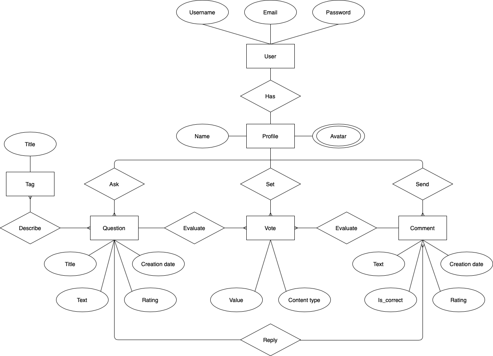
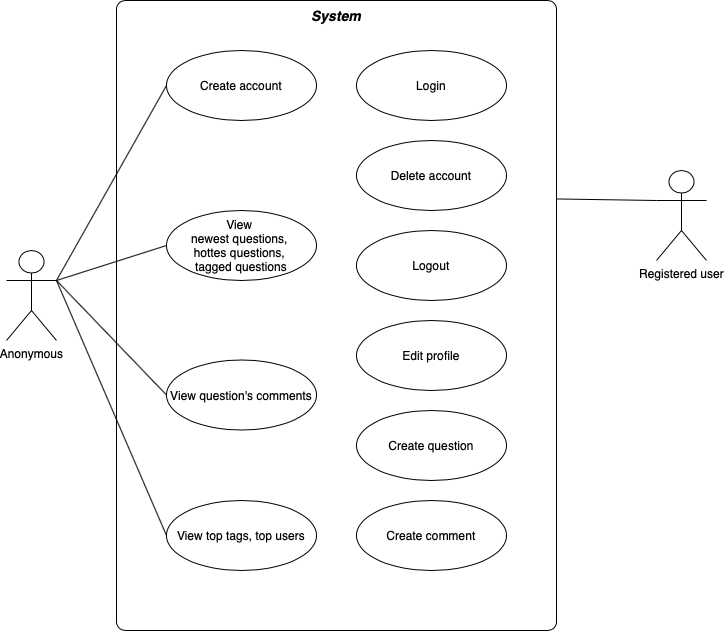

# Web-технологии; Технопарк; 1 семестр


# Цель работы:
Создать веб-приложение, в котором можно задать интересующий вас вопрос и получить на него ответ. Ответить на вопросы, ответы на которые вы знаете. Получить базовые знания веб-программирования

# Функциональные требования:
* Регистрация
* Вход / выход из приложения
* Просмотр и изменение информации о себе
* Просмотр списка вопросов
* Просмотр одного вопроса с ответами к нему
* Создание вопроса с тегами
* Создание ответа к вопросу
* Просмотр существующих вопросов и ответов

# ER-model

<p align="center">
  
</p>

# Use-case diagram

<p align="center">
  
</p>

# Apache HTTP server benchmarking tool - ab

Тестирование производительности web-приложения. Для этой цели можно использовать Apache HTTP server benchmarking tool

Результаты тестирования на введенных ниже параметрах:

`ab -c 100 -n 10000 http://127.0.0.1:8081/ &> out_ab_1.txt`
 
`-c concurrency` - Количество нескольких запросов, выполняемых одновременно

`-n requests` - Количество запросов на выполнение сеанса бенчмаркинга


# 10000 запросов без балансировки
```Console

ab -c 100 -n 10000 http://127.0.0.1:8081/api/v2/questions &> out_ab_1.txt

This is ApacheBench, Version 2.3 <$Revision: 1843412 $>
Copyright 1996 Adam Twiss, Zeus Technology Ltd, http://www.zeustech.net/
Licensed to The Apache Software Foundation, http://www.apache.org/

Benchmarking 127.0.0.1 (be patient)
Completed 1000 requests
Completed 2000 requests
Completed 3000 requests
Completed 4000 requests
Completed 5000 requests
Completed 6000 requests
Completed 7000 requests
Completed 8000 requests
Completed 9000 requests
Completed 10000 requests
Finished 10000 requests

Server Software:        nginx/1.19.5
Server Hostname:        127.0.0.1
Server Port:            80

Document Path: /api/v2/questions/
Document Length:        12142 bytes

Concurrency Level:      100
Time taken for tests:   158.522 seconds
Complete requests:      10000
Failed requests:        0
Total transferred:      124050000 bytes
HTML transferred:       121420000 bytes
Requests per second:    63.08 [#/sec] (mean)
Time per request:       1585.216 [ms] (mean)
Time per request:       15.852 [ms] (mean, across all concurrent requests)
Transfer rate:          764.20 [Kbytes/sec] received

Connection Times (ms)
              min  mean[+/-sd] median   max
Connect:        0    0   0.2      0       5
Processing:    88 1578 161.5   1572    2160
Waiting:       84 1577 161.5   1571    2159
Total:         88 1578 161.4   1572    2160

Percentage of the requests served within a certain time (ms)
  50%   1572
  66%   1617
  75%   1645
  80%   1672
  90%   1749
  95%   1847
  98%   1964
  99%   2007
 100%   2160 (longest request)
```

# 10000 запросов с балансировкой
```Console
ab -c 100 -n 10000 http://127.0.0.1:8081/api/v2/questions &> out_ab_1.txt
This is ApacheBench, Version 2.3 <$Revision: 1706008 $>
Copyright 1996 Adam Twiss, Zeus Technology Ltd, http://www.zeustech.net/
Licensed to The Apache Software Foundation, http://www.apache.org/

Benchmarking 127.0.0.1 (be patient)
Completed 1000 requests
Completed 2000 requests
Completed 3000 requests
Completed 4000 requests
Completed 5000 requests
Completed 6000 requests
Completed 7000 requests
Completed 8000 requests
Completed 9000 requests
Completed 10000 requests
Finished 10000 requests

Server Software: nginx/1.19.5
Server Hostname: 127.0.0.1
Server Port: 80

Document Path: /api/v2/questions/
Document Length: 12142 bytes

Concurrency Level:      100
Time taken for tests:   158.522 seconds
Complete requests:      10000
Failed requests:        2
Total transferred:      123700000 bytes
HTML transferred:       124210000 bytes
Requests per second:    63.08 [#/sec] (mean)
Time per request:       1585.216 [ms] (mean)
Time per request:       15.852 [ms] (mean, across all concurrent requests)
Transfer rate:          764.20 [Kbytes/sec] received


Connection Times (ms)
              min  mean[+/-sd] median   max
Connect:        0    0   0.2      0       5
Processing:    88 1578 161.5   1560    2160
Waiting:       84 1577 161.5   1573    2163
Total:         88 1578 161.4   1575    2159

Percentage of the requests served within a certain time (ms)
  50%   1601
  66%   1631
  75%   1649
  80%   1665
  90%   1735
  95%   1893
  98%   1934
  99%   1989
 100%   2202 (longest request)
```
____

# Figma animation

<p align="center">
  
</p>


